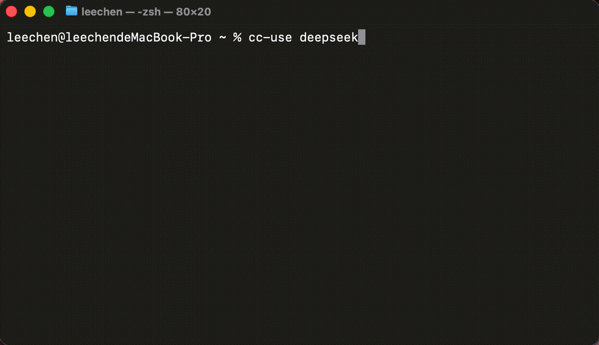

# cc-use

[](https://www.npmjs.com/package/cc-use)

用 DeepSeek、Kimi、Qwen、GLM、MiniMax、火山方舟、BytePlus ModelArk、OpenRouter 等第三方 Anthropic 兼容服务启动 Claude Code —— 国内厂商和它们的国际站都覆盖 —— 不动你的 `~/.claude/`。



## 安装

```bash
npm install -g cc-use
```

要求 Node ≥ 18，且已装 Claude Code（`npm install -g @anthropic-ai/claude-code`）。在 macOS / Linux 上充分测试；Windows 只在 CI 跑了 build + test，交互流程没有人工跑过，best-effort 支持。

## 使用

```bash
cc-use init                       # 交互式：选模板、输入 API Key
cc-use deepseek                   # 用 DeepSeek 启动 Claude Code（profile 不存在会自动 init）
cc-use deepseek -p "审查 X"       # 一次性查询（profile 后的参数全部透传给 claude）
cc-use                            # 用默认 profile 启动

cc-use ls                         # 列已配置的 profile
cc-use default [profile]          # 显示 / 设置默认 profile
cc-use doctor [profile]           # 校验 profile（--all 校验所有）
cc-use import-history [profile]   # 把当前项目的 ~/.claude/ 历史拷进 profile
cc-use --help                     # 完整命令参考
```

`[profile]` 可省略，不传则使用默认 profile。

`import-history` 默认原样拷贝历史。DeepSeek 或其他 provider 无法恢复 Claude thinking / 工具调用历史时，追加 `--sanitize`；它会保留可读文本，删除 Claude thinking 块，并把历史工具调用 / 媒体 / 工具结果块转成普通文本标记后再写入 `~/.cc-use/sessions/<profile>/`。

profile 配置存在 `~/.cc-use/providers/<name>.json`（chmod 600）。每个 profile 用独立的 `CLAUDE_CONFIG_DIR=~/.cc-use/sessions/<name>/`，原生 `~/.claude/` 永远不读不写。

## 内置 provider

| 模板          | 提供商                          | 端点                                          |
|---------------|----------------------------------|-----------------------------------------------|
| `deepseek`    | DeepSeek V4（直连）              | `api.deepseek.com/anthropic`                  |
| `kimi`        | Moonshot Kimi K2.6（直连，CN）   | `api.moonshot.cn/anthropic`                   |
| `kimi-plan`   | Moonshot Kimi Coding Plan        | `api.kimi.com/coding/`                        |
| `glm`         | 智谱 GLM 5.1（CN）               | `open.bigmodel.cn/api/anthropic`              |
| `glm-intl`    | 智谱 GLM 5.1（国际，z.ai）       | `api.z.ai/api/anthropic`                      |
| `qwen`        | 阿里百炼 DashScope（直连，CN）   | `dashscope.aliyuncs.com/apps/anthropic`       |
| `qwen-plan`   | 阿里百炼 Token Plan（CN）        | `token-plan.cn-beijing.maas.aliyuncs.com/apps/anthropic` |
| `qwen-intl`   | 阿里 Model Studio（国际）        | `dashscope-intl.aliyuncs.com/apps/anthropic`  |
| `minimax`     | MiniMax M2.7（CN）               | `api.minimaxi.com/anthropic`                  |
| `minimax-intl`| MiniMax M2.7（国际）             | `api.minimax.io/anthropic`                    |
| `volcengine-plan` | 火山方舟 Coding Plan（CN）   | `ark.cn-beijing.volces.com/api/coding`        |
| `byteplus-plan` | BytePlus ModelArk Coding Plan（字节给海外起的另一个品牌，跟 Volcengine 是同一套技术） | `ark.ap-southeast.bytepluses.com/api/coding` |
| `openrouter`  | OpenRouter                       | `openrouter.ai/api`                           |
| `custom`      | 自定义（你来填）                 | （手动）                                      |

带 `-plan` 的是订阅入口（Coding Plan / Token Plan），通常是厂商专门给 Claude Code 适配的那条路，按月固定费、不按 token 计。

模板里都不带 API Key，运行 `cc-use init` 时再输入。

## 开发

```bash
git clone https://github.com/leechen298/cc-use.git
cd cc-use
pnpm install        # npm/yarn 也能用；仓库只提交 pnpm-lock.yaml
pnpm build
pnpm test
```

## License

MIT © leechen298
